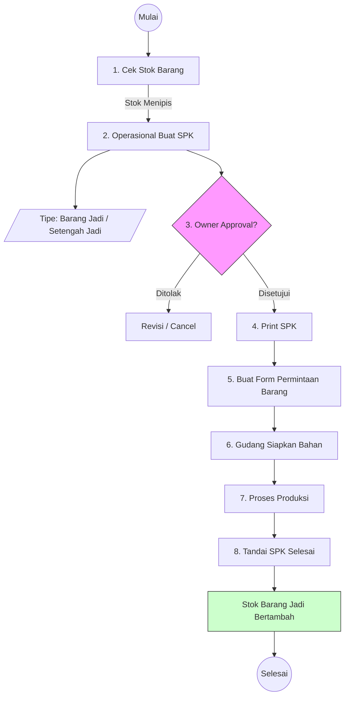
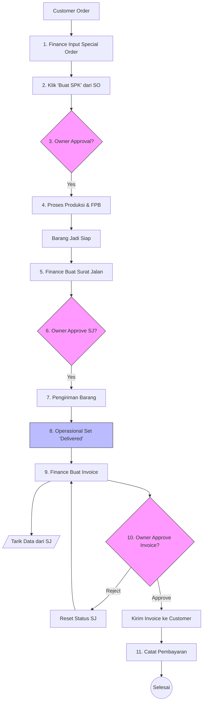

# 📘 Buku Panduan Sistem Informasi Manajemen CV. BDB

Dokumen ini adalah panduan resmi penggunaan sistem ERP CV. Berkah Doa Bunda. Panduan ini mencakup penjelasan istilah, hak akses pengguna, alur kerja sistem (flowchart), dan panduan teknis per modul.

---

## 📚 Daftar Isi

1.  [Glosarium & Istilah](#1-glosarium--istilah-penting)
2.  [Manajemen Pengguna (Roles & Permissions)](#2-manajemen-pengguna-roles--permissions)
3.  [Alur Kerja Sistem (Flowchart)](#3-alur-kerja-sistem-flowchart)
    *   [A. Alur Produksi Regular (Stok)](#a-alur-produksi-regular-make-to-stock)
    *   [B. Alur Pesanan Khusus (Custom)](#b-alur-pesanan-khusus-make-to-order)
4.  [Panduan Fitur Per Modul](#4-panduan-fitur-per-modul)

---

## 1. Glosarium & Istilah Penting

Sebelum menggunakan aplikasi, pahami istilah-istilah berikut:

| Istilah | Kepanjangan | Penjelasan |
| :--- | :--- | :--- |
| **SO** | *Special Order* | Pesanan khusus dari pelanggan untuk produk yang mungkin tidak ada di stok reguler atau request khusus. |
| **SPK** | *Surat Perintah Kerja* | Dokumen perintah dari manajemen ke bagian produksi untuk membuat barang. Ada 2 tipe: **Barang Jadi** (Produk akhir) dan **Barang Setengah Jadi** (Adonan/Base). |
| **FPB** | *Form Permintaan Barang* | Bukti pengambilan bahan baku dari gudang untuk dibawa ke lantai produksi berdasarkan SPK. |
| **SJ** | *Surat Jalan* (Delivery Note) | Dokumen yang wajib dibawa supir saat mengirim barang ke customer. Berisi daftar barang dan jumlah fisik. |
| **Invoice** | *Faktur Penagihan* | Dokumen tagihan harga yang harus dibayar customer. Dibuat berdasarkan Surat Jalan yang sudah terkirim. |
| **Barang Jadi** | *Finished Goods* | Produk akhir yang siap dijual (contoh: Cat Tembok 5Kg, Cat Minyak 1L). |
| **Bahan Baku** | *Raw Material* | Bahan dasar untuk produksi (contoh: Tepung, Zat Pewarna, Kaleng Kosong). |

---

## 2. Manajemen Pengguna (Roles & Permissions)

Sistem ini membagi akses menjadi 3 role utama. Berikut adalah matriks wewenang setiap role:

| Fitur / Aksi | 👑 Owner (Pemilik) | 💰 Finance (Keuangan) | 🏭 Operasional (Gudang/Prod) |
| :--- | :---: | :---: | :---: |
| **Inventory (Stok)** |
| Melihat Stok | ✅ | ✅ | ✅ |
| Tambah Item Baru | ✅ | ❌ | ✅ |
| Edit Data Item | ✅ | ❌ | ✅ |
| **Special Order (SO)** |
| Buat Order Baru | ✅ | ✅ | ⚠️ (View Only) |
| **SPK (Produksi)** |
| Buat SPK | ❌ | ❌ | ✅ |
| **Approval SPK** | ✅ (Wajib) | ❌ | ❌ |
| Selesaikan SPK | ❌ | ❌ | ✅ |
| **FPB (Gudang)** |
| Buat FPB | ❌ | ❌ | ✅ |
| Print FPB | ✅ | ❌ | ✅ |
| **Surat Jalan (SJ)** |
| Buat Surat Jalan | ❌ | ✅ | ⚠️ (Bantu Input) |
| **Approval SJ** | ✅ (Wajib) | ❌ | ❌ |
| Set Pengiriman (Delivered) | ❌ | ❌ | ✅ |
| **Invoice (Tagihan)** |
| Buat Invoice | ❌ | ✅ | ❌ |
| Edit Invoice (Draft) | ✅ | ✅ | ❌ |
| **Approval Invoice** | ✅ (Wajib) | ❌ | ❌ |
| **Reject (Tolak) Invoice** | ✅ | ❌ | ❌ |
| Input Pembayaran | ❌ | ✅ | ❌ |

---

## 3. Alur Kerja Sistem (Flowchart)

Berikut adalah visualisasi alur kerja sistem menggunakan diagram.

### A. Alur Produksi Regular (Make to Stock)
Digunakan untuk mengisi stok gudang tanpa menunggu pesanan customer.

### B. Alur Pesanan Khusus (Make to Order)
Digunakan saat ada pesanan masuk dari customer.

---

## 4. Panduan Fitur Per Modul

### 📦 Modul Inventory
*   **Akses:** Semua Role (View), Operasional (Edit).
*   **Fungsi:** Melihat ketersediaan stok fisik real-time.
*   **Tips:** Jangan mengedit stok manual (via edit item) jika selisih stok disebabkan oleh produksi. Gunakan alur SPK agar pemakaian bahan tercatat. Update manual hanya untuk *Stock Opname* atau penyesuaian awal.

### 📝 Modul SPK (Surat Perintah Kerja)
*   **Cara Membuat:** Menu SPK -> Buat SPK Baru.
*   **Data Wajib:**
    *   *Tipe:* Pilih "Barang Jadi" atau "Setengah Jadi".
    *   *Target:* Pilih produk yang mau dibuat.
    *   *Deadline:* Tanggal target selesai.
*   **Penting:** SPK yang sudah "Planned" akan membooking stok bahan baku secara virtual.

### 🚚 Modul Surat Jalan (Delivery Note)
*   **Syarat Utama:**
    1.  Harus ada **Customer**.
    2.  Harus ada **Barang** (bisa dari Pilih SO atau Pilih Manual Item).
*   **Status Pengiriman:**
    *   *Approved:* Sudah disetujui Owner, belum jalan.
    *   *Delivered:* Barang sudah sampai di customer. Tombol ini baru muncul setelah status Approved.
*   **Koneksi ke Invoice:** Surat Jalan yang belum status **Delivered** TIDAK AKAN muncul di menu pembuatan Invoice.

### 💰 Modul Invoice (Penagihan)
*   **Fitur Keamanan:** Invoice tidak bisa dibuat manual sembarangan. Harus **"Tarik Data"** dari Surat Jalan yang valid.
*   **Cara Revisi (Edit):**
    *   Jika status **Draft / Menunggu Persetujuan**: Klik tombol kuning **"Edit Invoice"**.
    *   Jika status **Disetujui Owner**: Minta Owner klik tombol **"Tolak"** (Reject). Setelah ditolak, Surat Jalan akan lepas kaitan dan bisa dibuatkan Invoice baru yang benar.
*   **Pembayaran:** Bisa dicatat bertahap (Partial Payment) atau langsung Lunas.

---
*Dokumen diperbarui terakhir: 10 Desember 2025*
*Dibuat Otomatis oleh Sistem*
