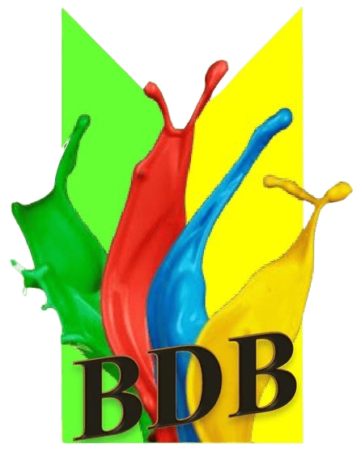

# Sistem ERP Pabrik Cat (CV BDB)

Sebuah sistem Enterprise Resource Planning (ERP) komprehensif yang dirancang khusus untuk manajemen operasional pabrik cat. Sistem ini mengintegrasikan seluruh proses bisnis mulai dari pengelolaan stok bahan baku, produksi (SPK), hingga penjualan dan keuangan.



## 🚀 Fitur Utama

Sistem ini mencakup berbagai modul yang saling terintegrasi:

### 1. 🏭 Manajemen Produksi (SPK)
*   **Surat Perintah Kerja (SPK)**: Pembuatan dan pelacakan status SPK (Pending, In Progress, Completed).
*   **Production Log**: Pencatatan riwayat produksi harian.
*   **Quality Control**: Monitoring hasil produksi barang jadi.
*   **Job Costing**: Perhitungan biaya produksi internal.

### 2. 📦 Inventory Management
*   **Bahan Baku**: Stok masuk, keluar, dan history pergerakan bahan.
*   **Packaging**: Manajemen stok kemasan (kaleng, pail, drum, dll).
*   **Barang Jadi**: Stok produk siap jual.
*   **Stock Opname**: Penyesuaian stok fisik dan sistem.
*   **Faktur Permintaan Barang (FPB)**: Kontrol pengeluaran barang dari gudang.

### 3. 💰 Penjualan & Keuangan
*   **Sales Orders**: Pencatatan pesanan penjualan.
*   **Invoicing**: Pembuatan tagihan otomatis dari Surat Jalan.
*   **Pembayaran**: Pelacakan status pembayaran (Paid/Unpaid/Partial).
*   **Delivery Notes (Surat Jalan)**: Manajemen pengiriman barang ke customer.

### 4. 🤝 Manajemen Relasi
*   **Supplier**: Database pemasok dan riwayat pembelian (Purchase Order).
*   **Customer**: Database pelanggan dan riwayat transaksi.

### 5. 📊 Laporan & Analitik
*   **Laporan Produksi**: Output produksi harian/bulanan.
*   **Laporan Penjualan**: Rekap omzet dan performa penjualan.
*   **Laporan Stok**: Sisa stok dan valuasi aset.

---

## 🛠 Teknologi yang Digunakan

*   **Framework**: [Laravel 11/12](https://laravel.com)
*   **Database**: MySQL
*   **Frontend**: Tailwind CSS, Blade Templates, Alpine.js
*   **Icons**: Lucide Icons
*   **Hosting**: Hostinger

---

## 💻 Cara Instalasi (Lokal)

1.  **Clone Repository**
    ```bash
    git clone https://github.com/danzyyy19/erp_bdb.git
    cd erp_bdb
    ```

2.  **Install Dependencies**
    ```bash
    composer install
    npm install
    ```

3.  **Environment Setup**
    *   Copy file `.env.example` menjadi `.env`.
    *   Sesuaikan konfigurasi database (DB_DATABASE, DB_USERNAME, dll).

4.  **Generate Key & Migrate**
    ```bash
    php artisan key:generate
    php artisan migrate --seed
    ```

5.  **Jalankan Aplikasi**
    ```bash
    npm run dev
    php artisan serve
    ```

---

## 🔐 Hak Akses User

Sistem membedakan akses berdasarkan role:
*   **Owner**: Akses penuh ke seluruh modul dan laporan keuangan.
*   **Finance**: Fokus pada Invoicing, Pembayaran, dan Pembelian.
*   **Operasional**: Fokus pada SPK, Inventory, dan Surat Jalan.

---

&copy; 2026 CV Berkah Doa Bunda. All rights reserved.
